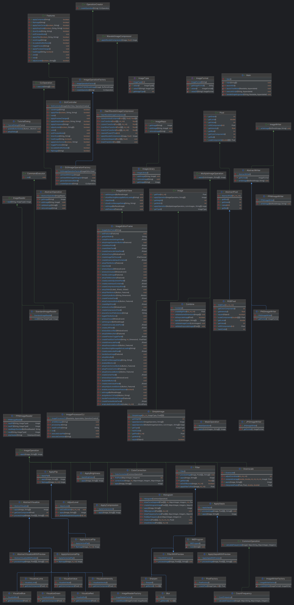

ImageCitationAndPermission: 
    
#### Sample Image Path inside the Project : **Assignment4Part1(IME)/test/resources/manhattan-small.png**

    All Image used within the project file are owned by Project owners and can be used for testing for project purposes.

<h2>How to RUN Script:</h2>

Currently, we support CLI commands and Script file

    load image-path image-name  
    save image-path image-name  
    red-component image-name dest-image-name  
    green-component image-name dest-image-name  
    blue-component image-name dest-image-name  
    value-component image-name dest-image-name  
    luma-component image-name dest-image-name  
    intensity-component image-name dest-image-name  
    horizontal-flip image-name dest-image-name  
    vertical-flip image-name dest-image-name  
    brighten alpha image-name dest-image-name 
    darken alpha image-name dest-image-name 
    rgb-split image-name dest-image-name-red dest-image-name-green dest-image-name-blue  
    rgb-combine image-name red-image green-image blue-image  
    blur image-name dest-image-name  
    sharpen image-name dest-image-name  
    sepia image-name dest-image-name  

To Run a script file use the below command:

<h3> run Path-to-script-file</h3>

Sample Script File (Requires Replacing Image path and destination as per your machine):

    load <inputFilePath> test
    red-component test redImage
    green-component test greenImage
    blue-component test blueImage
    value-component test valueImage
    intensity-component test intensityImage
    luma-component test lumaImage
    save <destinationPath>\red.png redImage
    save <destinationPath>\green.png greenImage
    save <destinationPath>\blue.png blueImage
    save <destinationPath>\value.png valueImage
    save <destinationPath>\intensity.png intensityImage
    save <destinationPath>\luma.png lumaImage
    exit

## Design Objective:

- Adhere to SOLID principles.
- Minimum to no changes to existing class files.
- Should be easy to onboard new operations.
- Avoid duplicate code.
- Follow configurable coding practices.

ClassDiagram :

---

## View:

### Interfaces:

1. **CommandExecutor**: Contains a method to start execution with a `run` method for listening to CLI commands.
    - **Class**:
        - `ImageProcessorCLI`: Implements the `run` method to continuously listen to user commands or script files.

2. **OperationCreator**: Contains methods to connect controllers to operations based on user commands.
    - **Class**:
        - `ImageOperationFactory`: Creates operation objects to connect CLI inputs and arguments to the controller interface.

---

## Controller:

### Interfaces:

1. #### **CLIOperation**: Mandates the `execute` method, which calls the operation class.
    - **Abstract Class**:
        - `AbstractOperation`: Manages the image cache per execution to store user images, supports adding and getting images, and validates command arguments.
            - **Abstract Class**:
                - `AdjustBrightness`: Conducts basic checks before handing over the image to operations.
                    - `Brighten`: Overrides the `AdjustBrightness` execute method for brightness operations.
                    - `Darken`: Overrides the `AdjustBrightness` execute method for darken operations.
                - `Filter`: Handles calls to blur or sharpen methods by creating operations based on the passed command.
                - `Flip`: Conducts sanity checks on arguments and the image involved in the operation.
                    - `VerticalFlip`: Returns the vertical flip operation object to interact with the model layer.
                    - `HorizontalFlip`: Returns the horizontal flip operation object.
                - `Visualize`: Manages requests to visualization functions (RGB component, luma, intensity, and value).
            - **Classes**:
                - `CombineRGB`: Combines three images into one RGB image and validates dimensions and values.
                - `Load`: Loads a given image from the path and uses the reader based on the image format.
                - `Save`: Saves the image to the given path by converting it to a buffered image before using the `ImageIO` JDK.
                - `Sepia`: Handles sepia image operations by request and argument validation.
                - `Compress`: Handles image compression requests by validating arguments and executing the appropriate operations.

---

## Operations:

### Interfaces:

1. **ImageOperation**: Handles operations on a single image (e.g., Darken, Blur).
2. **MultiImageOperation**: Handles operations involving multiple images (e.g., combining R, G, B images).

### Abstract Classes:

1. **AbstractVisualize**: Contains the generic `apply` operation for visualization and fetches the replacement value from each concrete class.
    - **Concrete Classes**:
        - `VisualizeRed`: Returns the red component of the image.
        - `VisualizeGreen`: Implements the method to return the green component of the image.
        - `VisualizeBlue`: Implements the method to return the blue component of the image.
        - `VisualizeLuma`: Rounds the luma value and returns it to the abstract class.
        - `VisualizeIntensity`: Returns the intensity of the image.
        - `VisualizeValue`: Returns the value component of the image.
2. **ApplyBrightness**: Applies the alpha value from the controller to the image.
3. **ApplyFlip**:
    - `ApplyHorizontalFlip`: Flips the image horizontally.
    - `ApplyVerticalFlip`: Flips the image vertically.
4. **Filter**: Applies the kernel by traversing all image points (Kernel Operations).
    - **Concrete Classes**:
        - `Blur`: Returns the Gaussian kernel matrix on the image.
        - `Sharpen`: Returns the sharpening 5x5 matrix for each pixel.
5. **Sepia**: Applies the sepia filter to the image by performing color transformations on individual pixels.
    - **Concrete Classes**:
        - `Sepia`: Returns the sepia filter applied image.

### ImageIO:

1. **Interfaces**:
    - **ImageWriter**: Defines methods for writing image files to disk.
    - **ImageReader**: Defines methods for reading image files from disk.

2. **Abstract Classes**:
    - **AbstractWriter**:
        - `JPGImageWriter`: Provides functionality for writing JPG image files to disk.
        - `PNGImageWriter`: Provides functionality for writing PNG image files to disk.
        - `PPMImageWriter`: Represents a reader for images in PPM format from a specified file name.
        - `ImageWriterFactory`: Supplies the respective object based on the formats.

3. **Concrete Classes**:
    - `PPMImageReader`: Supplies the reader object specifically for PPM formats.
    - `ImageReaderFactory`: Supplies the respective reader objects.
    - `StandardImageReader`: Represents a reader for images in JPG and PNG formats from a specified file name.

